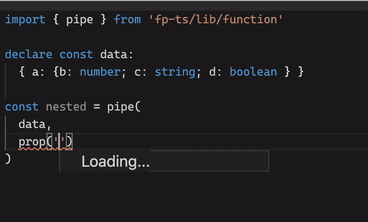

# glasses-ts - EXPERIMENTAL

Practical Optics. Unfancy monocles

A facade on top of [monocle-ts](https://github.com/gcanti/monocle-ts) 



Not yet published to npm, but you can experiment with types/inference here:
- [get](https://www.typescriptlang.org/play?#code/JYWwDg9gTgLgBAbzmYYCmcC+cBmUIhwDkOYAtDAM4D0ANsAEbU4CuAdgMYzARtEBQoSLDgAqOAENKcAPK58hEuSp1G1GWG68BQ6PHFS4AUXkFipCjXpMjwGAAs0UAfw69K8CXAC8yVGgAKBAkALjgARgAmAGZMABo4AHM0GACiCSIASkz+fmp8goK86iSUuHziwqL+ABM0DloJKAw3Ng9SmDCAHn44OABJNhwnON64AAUJBzg0AA8YNDYa6XYAazYIAHc2GfnF5YGhpzG+gH5D4agJBlo0E7gwyYdKLsHLgD5dhaXpN6dr273c5PewvP5Qd73MJsNAAN2O7wCYwAdKiwFN7I8MfxMj5PmsNtsvvtfkcoGNzl0AMLuGBQFhcNA1Yk-OAAIRYwFoNRkDAAVl0QQkCVs2O9Efc+hB+WEaW06QyFjV7rjvJ8AOLAeEaGBdACCMBB1Np9MZNQSIPeFoxkL6YQC0r5YXBqo1WrQOv1hoxrzJ1ocVomNtyVVDxWQGOkFVDVVyc2E8BgAE90EHnvqLc1YSyDiLtgBtAC6PjgRc+3jGAB8Jlmq3AAHIsWi0EEvSVwPWjPrdmtwrs92SaHhsVs9AfdzvtvrjLP98cAJTQOGAMJAi296c7vdhCV5fPqG9BGe3CRh8IhtoHl76kP4ydTjebo63M7hOZWbHWoqLCSMtEoaDlnACoYHM3wHP0lCPrQ+qXqc7bVq+sIIaWqLIkhCREKcRCFihOrDqOU4TnO46oaiGHENhhYkQuS4rmga5sIebakQO9a8NBAJoLBNGkfmaEUVhOG8eOe4HqO7FsJxNzcXqgb8eRs6UcJcBnk416kRpPaXmEf4Abk94YIuy6ruuhF9Hq77sv2SFWXmbA-mMeloP2bIlnq-BAZZYEknA9kUqWbLFj5rL5nquE9uczlQtucDVmJXDPgkCnoUpAQMGEbKunADBwMA0jhaecLqWM0LFeSd4phgCXMWOHY2VmdmfoSDnUU5-4uWMADSaBJlZqy9RAOAdiWAAqLBgLcPVJkNsGeSWIFWQAElIACqSxoJQwDNDU00vHJAXRXaKFIShKUUc0Eg1LwtB9dNRYRQO1YBN5eysvZRZwMCkb6vmbAsCADBONRZGpX2qkA0DUCFp8ZXnjk47PdNTVfkS32bvm00g+dSlY7DqnlTklWpvhvBJbFIW5s134g85QFhcFb0HPmYwyMipNsF0K6XHAADKBCAfwj3o0e-NrslAlKVhlACzhOmluFVn5kYyK2A4Thc2ScAADJLjACTc04cDzsAiT2DA7zC2mR66zg+ug4Jpy3HbctxdbLwm2b9s4+DWFQKb5ty6VxgdSGMaFOGBoguU1CVOHsf8PGejAVVHaHseepQIk0iU9Il3XWwt1+dTBYw+5Wc50zedoFdN19SzQsBR5dodhXVn53XpaG1AcDTQkaHd8bm0wFbyO53AAShJIbBJtlXj5XlWvN925xRz6W6Lh4GlhGPVdwB3hd9QEA0zcNeqZEWQKIKW4yL73vV-ZDwOFmEer5uMxaYDFu-gdI-2A8cSKI1x4fUekAteDhfr-yhiDTeFt2xw0Ad2HevUrJCSvhA+wXRJLSVuDxIeW9v6oPHtLWWV8GZKzZhzTWPMxaATASvNORo6EJDgVpB4BNzxEL6iQ04-svYCCARQ8eytVZ2EcFALo9kDZa09ubS27ZV7pzkfbNhCDOFIJbj-XyWFnYwEEYw4Re9RFqwkTQo2tt7b2QUeOJRRpLGsOHuwxB5IewoJ4XvE+Q0OwYPTm-LGjjCFuI0a4jhakKrx1jPkdknJuR7hjnHSJcZZgJhTqmDkXIeT8kFBiduNcC5F1AbufkQFo4iKtnuYOZTjED1kcPGRPMsYBW0aySeYQJAz2ygwCAEBbgdKvhkuJ2S4HFL5G7ax3C8m10PnADw-s2CJEvkA+yVlKm2JiZkvcXQRnX3fnfe60Dn5hBWZgZxGyhkCh2Xube98PG-whgA0JZxzlZMufU2Q-IyyTPHnMlciQr4tIOOg9ZgzXnbPefE6s7A6gmSZG7f6zYzmAukKQtcBigGgq2Vc9mQ5eBdGuUi4he9dF63RYwzFwz3kq1MRrPcwoS5ikJXcnRfCA76MUS8rFVKxHq0kdIj5fJxTqIpW8jwCQkD5lWPs3qL8BVYBueE4OirElhmiSwbg-4ElJMTik5Ohk4ArUoOtOoW0dp7VgiWFZ49l7nBAsHV69zDk92rL8hZbtum9JrjsRCCh8rcQ6UmOCwF6R3Bbgi2gVkbXBpYKGjh0K6IwmZNagKdqw3lWSak-VkFoIWt8PG2FSa95RtTWEpsEbk3PJLS4jNerU6am1JoDObdx4H0KQyssC0Q3LSkDmsYmds6P0ebhINVDcWcwOi3Ra49DWNhAPqCug6YEjpxVocd8sp170NcZeijFdT9soIu4Gy7qETo4Ru+5hqOYSBgvuw90Nj1jrmi3DyOrM2p0vWO6987s5eWbcS04Ms0UppDfav99y-ZsoMbakDz6wMsr0VB6Nsbq2vtramLdCaGLri6F1ICXUrJtOnrPPEOUel9J2NBmNYT02oZEPqmdZacN4bQdhL6SHqNcNo4md9PaAZMZLPh8eTq2OLRQ0nOjqdxqTTQNNWackSxGFmA0FgdQuheLPgkdTrcrhJikQyoVXG0kYHBFxEsraj51idXWV1-y+jPUIwGrpZGvUIzduZ2ZdI-mXwvrhIAA)
- [set](https://www.typescriptlang.org/play?#code/JYWwDg9gTgLgBAbzmYYCmcC+cBmUIhwDkOYAtDAM4D0ANsAEbU4CuAdgMYzARtEBQoSLDgAqOAENKcAPK58hEuSp1G1GWG68BQ6PHFS4AUXkFipCjXpMjwGAAs0UAfw69K8CXAC8yVGgAKBAkALjgARgAmAGZMABo4SjQYAIBtIgkiAF0EsijogEoC-n5qMvLy0upE5LgyqorK-gATNA5aCSgMNzYPGpgwgB5+OFG4AEk2HCc4kbGABQkHODQADxg0NmbpRYdKQcnpqAA+FfXN7YmppwkGWgwAfjhUgDo33ft9w6djrLgwthoABuMzmowAahJaGcNltpABBGAfA7XKAJD7HObHAJg5BLexhD6zMZwIFQsKQ2hzAo+TGjAIQBgAKzC3ygNO8pzZJUavKqeL2dWoDV59X4a2E8BgAE90HAPvt4eiukCYRdpOwANZsCAAdzYqT+vkNp28cwAPvKVRa4AA5Fi0WgK4Yk0ZK3GjeYq4mujRaNjOj1jd2uhbeoOjABKaBwwEBIE2SPxiuVwISMmZbSTe0GSqtabggJBJzprtLo0x-Blcvtjudea9wLVcLgWp1+sNCSMtCSprgMCgLAwa1hl3GlFrtFzpYeQctjaBc+ebxeC4SRAe2SXfp4AeTLtDwZ9h+X729xE3OQjY2jsfjicDJ5Jtt4k9u92nx6frzPBY32S-E8MyZLNnRfNg3zuNBP1PVdz3-HJC2BH5rwra9SzCbskhKasMFvOM0ATNhs0+A94WbS4ACEfQXCiNTYbU9QNK9RiwtAfUonw4Hhfg+3Ikd1VbBj2zYOYnlSSi-gEltUnhLJcSeNjcUJFU4EtYDQP3PMfzggsAgYMJKI5U4GDgYAEUQosUNGAFkKgHDZQwDSuEfbiaNU6TLjbJjOzmNifQAaTQaU6LgTVgogHBuK4gAVFgwHuILpUi6deK4gch1CgAJKQAFUtjQShgC6ZoksVGdjB7NA5hCJcFyXHS1zgLoJGaXhaBCpLDXk0NLQCfjzhbbyOz+J561SNgWBABgnEQxrz0m6bZtOWzi2KXq4ACJLQuGtg4DGrTUiSuaVya46VqQtaHLlHdeHrVNVU8+jGJGrsqr7WSpMGy5UjmGQXluthBjjI44AAZQINBMR6-b5X3CGEwSea-weShIeyDDnjk0LUiMF5bAcJxgdROAABkYxgBIQacOBI2AABzewYF+MS4ZzcmcEp2Cmo3e5OYxtS2dIunGa55GgXXB4oAZpmMZqyrsJFUVhTKbiSKFJXRRKCU9H7Ry1eRPN4SgenpCe5q0Fa9qQt2k0uON03Qpatq2A654Shhp4eJs7iTbN77pGd63nmpqA4CShIV1D2nCpgT3w+C0KAlCSQ2GlYzJDM6Ro+9sYvZI3MEmjDxy3+BOQvNoPXZCgJwuSqL4QKQ0FMQZ55jMvausWmaoCyLIwnhVJ5j+TBlPL0Lu6cFuBtHZ6ROb0N88Niapp7xDi+ZoNVqnkkwm283-2ngvwMgj94WOIvY9LvfE4P1H0Zbz6cf+wHidBhGoZhkkl-xQYP8vkuW9Lo7zGDfCuAcLzS1FgIb+WMvqz2eHjAmjgoCDF2lTEmIsmYs0XgbX+WCuYb1Lj7Ky9ld7jzvnzGAMC85wJxkguwKC340w5lzXaODXQ-wcIMVhADN6hm3mQ0BFCIF10itxI+y9jp8OvsAoRgieTK0aPySiLBgC0GaMBDWSjlHilWJKPWcpVHqM0cyQYHwnaWxdm7W2iFgJ9gsebBesNgLy0cRAnS0cN4YNBsdVm+8IHJzCBINOGcGAQAgPcEJLdjEaOAoMbxshmSyICQgqubsPDSzYPTZxowni7VCq43BsTTFMgSbHBISAh4d3LivJavd+5CRentTAxCy4lPiYk+xY9UmCUnkIvJcAOlmK6cyE0PTb4QMyXGemLdektkPsUtRcSRkVKSUyQW7BWh3jQM0QWk1HRtLAaFDcaMEw0NgcMspXSAaaF3IMexRyREIN5hTC5tCrnlI8F2fGjCibAQSOwp58zLgbigbLIMTxPmJIYYTVB6D1nHCedCtZVTNQ1OOmELRrSx6kPlnizWyjVYsG4D2bRSjtb6N1rhOAOVKD5VaEVEqZVpxcQKebXOTwMrVR9jPPpq8aaWmmdkwW4TImWz2vOBQ5loIhOlBVbl+KHTQg5azRVPstkxgIns1Vgz1VlwJTrEQNLxyTlZb4TVOydUQM5f2QcPKDXKtCra-VCi9EGJpQAcWACCP0hdfaO0rlY4Oti+zcuylIM1cwHaUDqWvXirMX53N4KlH24bzZ0vtCAXMfs43LUTbc-0qay7pogXS-C95iI5tNnm3uFUk1FvPvLUtCC6WAyhNW2N-Ssj1sLfcptvLKUev1m25NbAO0xr4n7E599zlqvtfLGNM7wXUPnUORd07KFvLXQ6t1RqpQjqkBWwiiZBgBT7AFJOKc5VhIiVEvaXL7UGrskO6lh6JzKrPRemdRBYbhr3VS4176s1fq4pe82-S-1PoA8OuUcUEpoCSilc+XEjCrHaCwVogwxENwSDh32UAJDSjQcJJiSLX1AblGyd8GBfDpJrjafpNphWzNGH1IJqd060jgGK+961Bb0cSAOGZzcm7ySAA)
- [modify](https://www.typescriptlang.org/play?#code/JYWwDg9gTgLgBAbzmYYCmcC+cBmUIhwDkOYAtDAM4D0ANsAEbU4CuAdgMYzARtEBQoSLDgAqOAENKcAPK58hEuSp1G1GWG68BQ6PHFS4AUXkFipCjXpMjwGAAs0UAfw69K8CXAC8yVGgAKBAkALjgARgAmAGZMABo4EAgAE2AcAE8AgG0iCSIAXQSAKx8APjgSgGo4ABYASjr+fmoW1raW5upElLT0uA72weom5LQOWgkoDDc2D27UjLCAHn44OABJNhwnONW4AAUJBzg0AA8YNDZk6UOHSiXN7ahys4ur6UenCQZaDAB+OBZAB0INu9nun2e+TgYTYaAAbjs9gA1CS0E7nS7XOAAQRgYIeWx2ByO9lK-FKAT2YFJYTBuzWSWSADF2BwwgF4WFUbQ6mU4Dz+HzvOSAqENkSoMLypCmkM2p1kKTpAN5R1+GdhPAYOl0CS7kscQl9lN4Ri3tj2ABrNgQADubCy0N8TvK3j2AB8DqbPXAAHIsWi0MH3PZrNZGsPhk0IhnhtYaLRsEMrePxyNp6OmuOZgBKaBwwDhIEu+OVhuN2dkDCKYzLBqN3tjcDhiOe5MzHfD5P4Or1AaDKcbMbNryx0mttodToSRlolDQbrgMCgLAwY-eG0oA9ohq7fyjay9I8PcC9wNBVaIfwKp69iZ4yfLp-TOczgJBQJHCWvBTfeYLIs0BLNh63BVN33jP1eB3b5fj3f93wvL8rxvQoXzTGQazrFNoLYWCfjQBCP0vZtf0KFsEScLtIJotMuzCOcFyaPsMHzQti1LFM9hxc1xzgAAhOMRz4zdJ3tR10LWJi0DjASfFxCkFN4jdLTYG0JL2AEsgE6FVOkLIcXyKMARkqM6VNM9q1rLghwSZDvzgAIGDCATpTgBg4GAaQjISVtqL2WEqKgFjdQwLCbLA0MI2Eyz9LgcTpyk4x51kvYAGk0D6eKrSyiAcFxBSABUWDAX5MvSfK9yU3wVzXUTsQACSkABVK40EoYApmSCr7hxfcUuYtYQjvJt4VGhyqymCRkl4Wg+gqp1jMzL0AhUzExPUqdJLgAEhyyNgWBABgnAoybm0O47TvKIK20aFanIqhqJy2iTdv1cCcSyCqzs-Ryfpuyi7tCvUH14OyxuehLXqS2dUqXQy9I27Esj2GQgTBtgliLJ44AAZQIRd+GW96UwJkt7L+1DKEJgoGMBIyoayIwgVsBwnGxyU4AAGQLGAEhxpw4FzYAAHN7BgUoSb28teZwfmSJQsi-l+eW6aslMRfFhXzvhH8-igMWJbpwLBrQOU1VVXEwP6YZLfVTU9GXMLrYJRscSgUXpHi6bZrYeboY0pKlw9r2od9ua+lR4mtMU4bcU973kekCP-ajwWoDgCqEk-DPhY6mBpazrKobFMIJDYdJ3K8byvK5nETNd0kK3zjw6LCJ6fbQGbI6c3LKoKnE6idRukCyfY6+L9IDqOk6oHyfIwi+-ZoUwcyp6hy658b9aLReoPJNPAE8TdmervnhJ8zb09bqcdfO+T4gbx3sCljwgj4P6y+C-bjf4uvGmJYBDxm0ozeKWR0aY05rjcmi4SYgKbg4JYsDv7X0zLfEK8YO4l3-gbI2MBgHhlAUjPegIWZs0cFAJYiU2ACy5lrCWUsj6IPsEsBhCsr6SxvkDO+WC-6P2vKrAhjdEZM3IXYSh0ChZywVjQphmZj6vxkagrh6CeGYPDNg7Kj9+75TjkQlhhpvpZQopw3+-kNEYItvbO2XQBIsGALQZIEVbadBsU0R2IhWKCQcU4iKSwwTh27n7AONCZzWSXIE8BRcIqmyiY-ZCedOF0Nxj9WOD9SFl0kJXdyDAIAQF+BXRu9jHHOJrGwguCQIq-wyfxVOAcPCGzYKLEeCCaFQ1iQonxpT-HJMQICCeRYp5nzngvMI7TMB0XjiUvx5S+nVPvjgx+W9eEGJmWUooFSPBVJrK6RZ2jSGNKLKLRutTNy-mYes3plTrJWXYKMDiaBkhWUOkGKZMJ+GkIAbTS5viNlbIVpAzQj4ljVPeVoqGgi+aEIQVcuZNzxHsyoRFBIcjwWfP4teQ22sYVrL+dc7ZxhWYSI5jQnZRRSjorhZsvpY8rSTx+mEFxkz14WNNmytx8pFQsG4POVxlsPGnC1M7PUzVKBtVGJ1bqvU9wKXafFBuawAR1XNvHXe-EVmZy9Ec5pVk8kFO7mwDWChvJEQrukAaKr2WBnRAq2OVr473MAnCZ5dqlXLlXKqj5HLPHahdusbcNrZW+CdY811j9FXvQdd6m1UNI3Ks9ey4KgrhXeIAOLAERImFuock6kPqX0MJ+QlwqqhmKncEFc0jNOhSWOQKkzVXjqW+K5ajqGkTtW+eA160gv6qbZtj8xXsSAiBGA7avaduLXWjGwLeCNo+QO0hYrMZonHZQSd3aZ0Nr7WqlNTtvHLtnWwVduaQ6J0hX8QBaBCEJrXKbXNF7sXG3tYmtV57cFCJvR6u98cfVCv3S7IdzrgKliWOlJc6VS7inNbk-JhSjW3owFYjU-6vGAakBW8DClIO4KIFGz13rk0odTehwNIAwMQc3rPIWiHCNtj3WhvUJUypoAqlVfqCkjCnHGCwUYSxdGDwSAJhOUAJDpGoTDNglKGN+r1JCOCGBfAFqcr6TVvodUnKPE5LJMH+T6vg-dKyymNMj2HsZIAA)
- [modifyOption](https://www.typescriptlang.org/play?#code/JYWwDg9gTgLgBAbzmYYCmcC+cBmUIhwDkOYAtDAM4D0ANsAEbU4CuAdgMYzARtEBQoSLDgAqOAENKcAPK58hEuSp1G1GWG68BQ6PHFS4AUXkFipCjXpMjwGAAs0UAfw69K8CXAC8yVGgAKBAkALjgAbQBGACYAZgBdTAAaOBAIABNgHABPDS02APCiCSIUgAZ4lIArHwA+OBqAajgAFgBKNv5+ah7evv7e7upUjKzczR42OB6hgbnB-nS0DloJKAw3Ng8RzJy8ybCAHn44U7gASTYcJySTs4AFCQc4NAAPGDQ2dOlHh0pDy7XKD1N4fL7SQFOCQMWgYAD8EQAdMjfvZ-pDgfE4GE2GgAG43O6nABqEloL3en2+cAAgjBUQCrjc4KjandagEicgnvYwqjbmcdgAxdgcMIBPFhUm0Np1ODSu6y7xs04BUIXJlQJX1ADiwAJeUZQJSrK680GPW5f2m1Fm8y6b2E8Bg2XQLJ5-xpJvWeIpYOp7AA1mwIAB3NjhLG+SP1bx3AA+LJ9CbgADkWLRaKj-lzTl7c0n8QLBbIJrxs8cS2d81XTvcfcWqwAlNA4YC4kCfekew5ewt4lIyBhVZbdv6971FuC4gnAlUl+enNn8F1u9OZit9+v4v1U6RBkPhyMpIy0ShoWNwGBQFgYUF7i6Ude0XvzuEFxPbvEfpEohvEOEiHiH99nLHsC0FGta1OcJkURL8UiIQDKggs4WzbDsuwrVDBVTXhn2hWFX0baDf3g-8kKAkjoKHEcuArPC2AImE0GIsiEIAqjp3xJxF1rPjBXnMJT3PLpVwwdD2zQTs2DHNFK1pXdwTgAAhYsvyUgM2GDMMIxQ04RLQYsVJ8Wl+EvGlNP3bTDzYO4EXCFSsXvZTwhpYDBQRQyuT5H04ETWjR03FJYL-KcAgYMIVO1OAGDgYBpHclIZ14u4cR4qAxNdDBAvo8C83UvyXK0nSj304wzyMu4AGk0GyKy4EDOqIBwRTfAAFRYMBYVq7IWtfczTOvW8GoACSkABVL40EoYB1nSXrPTfCrRNOEIfy-H9QvIqd1gkdJeFoeresjDyS0TAJLOK6zSr0uAEU3cI2BYEAGCcSp2P-Z7Xve+p0tnToqwu3qGoPXT7vdccaXCXqPu2jjYb+7iAayt1QLYYL+1BmzdOPFaL1MtznMpVy7hkRF0cOdsgTgABlAgL34M6Hp7enOxCuCOKQygGaAoSInchrwiMRFbAcJwqc1OAABlWxgFJqacOAm2AABzewYFqZnIfk2WcHlz6pyQ2F9b5-ydf+FX1YN+GKLhKA1Y1vm0vxs1zRmS06VRG07XtfhHT0K9stpOSJ1pKBVeka64D2g62COuAwbKiyI6jknqVjw76vCLptZpF2aVThrM-j7PFagOBepSODy+VmaYG1kHo7VMIJDYbIYq8BL4ql-PPJDhk+xbDw+LCJv0+kEuE4CJq+tamk2kjLkESQcJ7h7yu6qel63qgeJ4jCaH7ixTAfM3+ro++3fl8U6Ok70gsES9nle23n695SYfNYLf6nDP8f-TSEojfZ+DhDiMWYkRGktRP711HufBq3NeY3yJkLcmlNa5swvGdfuoD7CHCwbAkeP9kZ-0FGPOqiD7aOxgAIfuqDo7C1FnYRwUBDj3wVlLK2GstaPwHi-bhBsv4CWxKQzK5CEHR2NnLOhZwHKC0YSLMWrDJY0z1gbe+vCqxP1Duooh38qy-3EWcChF8J6NWavPEBodoaw30fAlKxijFu3dh7YYKkWDAFoOkWiPtXELADiIcSqlPHeNoocb20cp71XvnjWil5InmKXqcBEtEXaJMAWRWuX9OE01hvZSR5iW6SHbjFBgEAICwjbjfDxXifHDkODk2Qw54EAIfNEuAHgHZsFVskuRiccbhgamk7RIS6nhKaavde7Zz5v13vvMI98sAiKiqE+pVRGn10HC0-+lDL47zIf02pYSGlNNojGXZZjMldPbKrG+bTlLANGcc9ZmyPDbJqImdgSwMJoHSObZ6mYVmFMyUgzssj+4vImVs2QFMyxsEOPE4FDzqTSNNnwqFpyYVKJYRLWiKRNHIr2eYpCDtrYQqOWs6F7zjDMPFmwjhzSqi1GBZijZkyIiBg3rDMIvjMAOIyi7RxLj7SWhYNwM8fjzQOleE6IObpxqUCmksWa81FqvlMks6OfcIbDTQAXBqV8laJhuT0825TKloDbubesBAEqsTbtkZaeqhUZnJNqgpLq1oDJ+VJf5HqUlXhvPq71wr-aysDsE84T43Uat8N81sfqGo6oRF60RgL3XmJTUG28QrBXhrlcEvUBpNBh0LpHYuVq44J1ifES8eqxpSGfApctlA5nvXMgU9B8KBreobdHRV6YQC9lTu2vey1u35F7aI-t5jFWSUwrJEdkcx11q7XCqd0CXazsyYq9GZJl1tqNeO9dlMt3evzgWyNwc93woPa2lOFapFwh5uCz1waC5F2fWSp277c0Xq-SSuEJtaF-pDem-NgTnQ3qkAu6SXZDjVUvNVBqxTHVlIqVUqYqbg0QdnDKwtMGY2ZkQ8hqhRBdW4ecVeoJRGh2kdMih-Z79KMjWo1B+VGBOrdTQL1fq0DTJGFeCsFgSxDizxarSFIEn55QCgBIbI7DBlsBZQR69boMSEQwL4DpnJTiJmPSmU1dz9NwACGh0pcoLVYcBubDpxml6L2AkAA)
- [insert](https://www.typescriptlang.org/play?#code/JYWwDg9gTgLgBAbzmYYCmcC+cBmUIhwDkOYAtDAM4D0ANsAEbU4CuAdgMYzARtEBQoSLDgAqOAENKcAPK58hEuSp1G1GWG68BQ6PHFS4AUXkFipCjXpMjwGAAs0UHeD1jJ0gHJGAgqcUWKtbUnrxG4DAAnj5QUBKRAvwcvJTwEgBciJKZ3j4AdKFs4ZrRsfEAPGwsIAxOAHxYcAC8yKhoABQIGXAA2gCMAEwAzAC6mAA0cMBslE4w7T1EEkSTAAwjkwAsAKwAbACU+-zHJyfU5xeX5-znUzNzcNdXz9THACZoHLQSUBjJM-BprNYJlyvw4BC4ABJNg4JzjcGQgAKEgccDQAA8YGg2G9pDDgTAJAxaGgUQ5KOUYXCoA1MdjcfjYU5iaTEZC4AB+Xp5XkEuassmo+yU6n1EbsyGZNhoABu8MlADUJLREXV2pLWLRaOT7JldQiObKVZllaqIftmnVEe1umKoJamg0AOLAeUaGBU+6wADSaEiMJgEBkDAAVl6aZMDXAzXUo8LrTcXhck3AouhpE9k9d+JjhPB0xgfDBdeUfJMYgBzaT0nF4uC-CRvXi0SJwdgAazYEAA7mweiMGi0qzWsXXpI3m2xW71jhKIdyfIjMiP0WPGQ20E2W22etMaXA-ZFJry8vunHAAEpoVLzrmH-1rhn122ZCRsSKOhoSKbSc9QOAlw5RcS2FMtJmvVJrQ5TIjyfcdN23ac23aDt-QgHBAP2AdJW5JAeiRO4H0iHoqhqJwRhGFcCJGLBJVgx9aw3MjaigXDAPgjdO27PscI5BdANAhwy1I6pWI2K8bxgaD+OlOUnHo4jOPrNDIgwwD2Lgpj6yITkBH4+9i1LQpPBYbVBTLONJKgyUIRXIT7BEo8JMg6TFJleU2LsuAPIU3MMXzNNInQOBXXdTRwMAqBq2UictynGduN7ftB2aNMoBYDBtOkAAJKRTO1MEIRHUTyKgCUZO5GQ8g9Hg2Es5d0sy2K4DyyhTJAMtosoUrxMquBVhakqWIo9igKlWQas0OqGu8mAMqy9d6za68cGmNAQBxT1hrEij+uq2reFmuBMnm5rstaqRDrYFUuurXq9sRKqpq0eqfBkldjjzNxC2hb0iRJIUKUipFfllFqkt42iWgHIdEQAHzgUG5QRuACp1YVKVswDDX45HZVxjlrt1LGDOKwm8bBimOVW9bNrYBzKXLJGqdkMNPkZkHWd82kZI5Pm4ETX70ZJrm5Qhtgu2SgdJiMWhZiHJrFuffF2rM2hjs5bHEfx7XZGm3hRexjly2N5EqbNiFaZlenOctyETPViz3upsmelPfHJl0ogNntiEQ1DDnRcd8zAcsyZ3d5T3iD0iSeYFgyE8hD7jHltBjl+62Nq2o3ipagAhXH8YlqWodxuXZlx-O0qXRW-AuyG2Ce3p89oi6eh8O8BIr9OYJZ8XEYDoPMciyO8mj9oGEyfOvzgBhf0AuP5NpRqeYz4KMCHrhc5xxFi4byWeJS8u09xrSlukVT1L8FoABUWDAUkjwwhrFbO5WELagBVXEb2AX43hHiZv1Huy49a6wMojMe0dUhQGmJWLukJEbtHrhfdsh9paIIMtyfksBBSix8A9cqEcPbc12uVJOfceZHEgXAdo58VY+WXveHmJ0-qEnwSPQhzkSFR1Zs5OoRx+C-WJlwqMYMS5HxlqnBWaUO5tzQT0REB0Db1X-HAAAygQNA1o7w4P+pw4GWjNq8PHqzIglBtE+xTvIlqPQjB5FsA4Jw5R1EABk0A4BgJMdRl5gCVnsNJPRetcEA1JKLDxXjTHRyIKSLx1iQkGMBqLPxATvE8j4XKL2cC0kJO8qA-ygVfqhKPIGYMYYips1DEXYULVJw7nQaXY+iIzT8EVrqOx6jnLNwYQhWB8DNKMTQVfTCAdsZVTDD0ZyLV2jqJiFAW+G9sJYMhHhP2vQfRERGVUqih4WpwW5LkAoYQIilDiJELqCyN4NEyAHKZKyOSYDNpkBA6yplbPQqMsMuzNkXU2RM0M9y4CIzNGwu5PoHmQieQZF59t3nTDgNsgOwLiI-JakisM95wW0VNCqM20KJq9OYuQ9iyKLqzOZABeZiz0DLPGWjXwxyiinPmRUal1zsZyU8u5ZejUOnty6f6E8vJfFST0Upcl3R3yfitJIBecz2IlP9GUgOkVXKTFjCiowGIvgsA+OUAOFYBYMTbBdb2ir-qlIZuU8MIdvhhwDlZdVMYVQNERuwD4a0ZRvEUkSnSnJLGbX0qsqpLUVGvVcZSzR2ik7PWul6QkVqgyquMWgCCUkNWuqTlyhSfc-XSF0jkwJwaBJkrQQ4pxjgoCRoPJE9Jvj-GBNjcYRxdgq3lDrZMJVAZrWqtSYE9NqRM20DqNmph3K81DMYbpOJMAS1YsxRdCtbaXHuM8fWqN-a3LYJbZWlx3aVUVM7dZdJsYIKNu3bJcduaJqvLJhsj5akvmhh+VOhCPp7b6MTcq3tFTwX+hchml1I77a3MmRC7GBKc1sUKT9Del1KA-w+JQf+aBAH+mAWlRuQ1m7v0aqgxhI0AKI36WwSsKKGAQAgKSd8KLQYEGALMco0r+p4e8lUbUOGBJsbYR6zx603hcfvDx6DX0ApwZClCNWhV3pYd-l6tDQnuQiZ8urJTStV68tgyIX6bVrq3RHHXbqLVdKBrQMG5TC18PGbNZyItc7cNWe8quWzs6LMafY1p76On4MrX4zbLa5QfSK1+Wg18kgPyz0o9RrcbBhMLTYWvbTBZfP5XVkFkLJm9LxeaqJ5LQUQptQ6hltKoXCPkJyxgPL3mUshXvo-NAz8cCWTStq3V+rtnM062UC5jdR1iaKfB+0go0r1OQnQ1GRHUakcrKjdo4XpVRaozRtgNCUVjZnDNnCdKgA)

# Contents

<!-- AUTO-GENERATED-CONTENT:START (TOC) -->
- [Contents](#contents)
- [Examples](#examples)
  - [`get`](#get)
  - [`set`](#set)
  - [`modify`](#modify)
  - [`modifyOption`](#modifyoption)
  - [`insert`](#insert)
- [TODO](#todo)
- [TSC Issues](#tsc-issues)
<!-- AUTO-GENERATED-CONTENT:END -->

## Examples

### `get`

[monocle-ts equivalent](https://www.typescriptlang.org/play?#code/JYWwDg9gTgLgBAbzmYYCmcC+cBmUIhwDkOYAtDAM4D0ANsAEbU4CuAdgMYzARtEBQoSLDgwAnukRwA8mG68sufIRLkqdRtVny+g8NHgAqOAENKMsEoLEQvCB1poKNek2082J2gP5oAHsLwwGwwaFA4JhwYAIKI-HCiEmgAXMTRAgkmqe68ADwI8QlwHKkA2mwsIAxhADRwlDBQwQDmdQwQEI4mbAC6hQkAJqkNTWzNpX1FcClw7Z1o3YWYAHz8mL4BBnDBoeGRGABCUuLoqUQHRFgbgYmSACImMCZwALxwsQA+cAf8A2gOJigGA4vAacAGjyycAeT34-BBbDBEDkHi8r2QqDQAApCrIAHTAAa5GEmZZYgCUNVxYDxOGAtF2WKxADdyalmdtzLEXss4My8ScMABCF5vIjpSnUvFgfBgLFEExESUJfGUAhoKkqmky5HyjhKzUWPEg-RsNAhLEARkl5LhCLBZoaaCGFh0uRGLV5b2ROi8eOaaBgOTYWIhT3JQA)

```ts
import { pipe } from 'fp-ts/function'
import type { Option } from 'fp-ts/Option'
import { get } from 'immutable-ts'

export interface A {
  type: 'A'
  a: O.Option<{
    c: [number, string, boolean]
    d: string[]
    e: boolean
  }>
}
export interface B { type: 'B' }
export type Data = A | B
declare const data: Data

const nested: O.Option<string> = pipe(
  data,
  get((v): v is A => v.type === 'A', 'a', '?some', 'c', '1')
)

const polymorphicFn = get((v): v is A => v.type === 'A', 'a', '?some', 'c', '1')
const polymorphicVal: O.Option<string> = polymorphicFn(data)

const pick: { b: number; d: boolean } = pipe(
  { a: { b: 123, c: 'abc', d: false } },
  get('a', ['b', 'd'])
)
```

### `set`

[monocle-ts equivalent](https://www.typescriptlang.org/play?#code/JYWwDg9gTgLgBAbzmYYCmcC+cBmUIhwDkOYAtDAM4D0ANsAEbU4CuAdgMYzARtEBQoSLDgAqOAENKcADK58hIiF4QOtNBRr0mMtG0oDBbGGig4JHDABEJMCYkkAuBw2dsWIBqaxZ+AEzQ1CSgMDl5KeD9bCWcbO35+MP14dX04AF5kVDQACn44WQA6YD8AHjiJAD4cgEoAGnyisHwwHKIJInrGmULmiFaiBk6GmoSkiLgvPQBlNBhY6Iy4VMpCyjmcsgBGACYAZhqcqLsaoA)

[immutability-helper equivalent](https://www.typescriptlang.org/play?#code/JYWwDg9gTgLgBAVzAEwIYwKZwGZQiOAclBARlQCNgAbYGATwFoALDasDKQgKG+ADtMUbKgDGWACLpUcAN5xUALjlwKy-ghAVOcAL57uyDKOqooWURH4BneGnLKp5XpZvx+GWxmSPpcALyIKOgYABT2qAA0ctxwCsqysXGqCUnJcAAk1hgwyowAjABMAMxpBnG63LoAlEA)

```ts
import { pipe } from 'fp-ts/function'
import { set } from 'immutable-ts'

const beenSet: { a: { b: number } } = pipe(
  { a: { b: 123 } },
  set(['a', 'b'], -123)
)
```

### `modify`

[monocle-ts equivalent](https://www.typescriptlang.org/play?#code/JYWwDg9gTgLgBAbzmYYCmcC+cBmUIhwDkOYAtDAM4D0ANsAEbU4CuAdgMYzARtEBQoSLDgAqOAENKcADK58hIiF4QOtNBRr0mMtG0oCh0eOKlwAkvILFSmuo2rmAJnu4wAngMFsYaKDgkODAARCRgJREkALkiGGLYWEAY-LCx+FzUJKAwOXkp4JzCJGNDw-n5c-XgIMG5eCVo4AF5kVDQACn44WQA6YCcAHlKJAD52gEoAGi7esHwwdqIJIimZmR65msWGFenx8sr8uGUnYBxgNCcSoubW9E7umrq2Bsm4NZ6Ts-d2gCtmkZwf4AajgABYpu9uuYehIFoVwvtxkA)

[immutability-helper equivalent](https://www.typescriptlang.org/play?#code/JYWwDg9gTgLgBAVzAEwIYwKZwGZQiOAclBARlQCNgAbYGATwFoALDasDKQgKG+ADtMUbKgDGWACLpUcAN5xUALjlwKy-ghAVOcAL57uyDKOqooWURH4BneGnLKp5XpZvx+GWxmSPpcALyIKOgYABT2qAA0ctxwCsqysXGqCUnJcAAkqGBg1PTKoQBWAJQBAHxwhXAA1HAALGkGcbrcusVAA)

```ts
import { pipe } from 'fp-ts/function'
import { set } from 'immutable-ts'

const modified: { a: { b: number } } = pipe(
  { a: { b: 123 } },
  modify(['a', 'b'], (j) => j + 4)
)
```

### `modifyOption`

[monocle-ts equivalent](https://www.typescriptlang.org/play?#code/JYWwDg9gTgLgBAbzmYYCmcC+cBmUIhwDkOYAtDAM4D0ANsAEbU4CuAdgMYzARtEBQoSLDgwAnukRwA8mG68sufIRLkqdRtVny+g8NHgAqOAENKMsEoLEQvCB1poKNek2082J2gKEG4xszgASSsVUmcNJiCAEzQ2bnEBQXi0KBwTDgwAERMYEykTAC44KDQTaN5aMSkGYrYWEAZUrABtAF0sfn4OXkp4CDkPLzgAXmRUNAAKfjgLADpgaIAeHLyAPkmASgAaGfmwfDBJohMiHb3ZBbZYgA9JgAZz2cuDgeOGM93NrtiHE1K4D02H04NFckU4KsTF0gSDbNFgDgxNo0NFiu5eCtwWtRuN0NNZgMdF5tnALmA5vDEcjBrxJgArUY4xkAajgABYdmTZkE5iYjmC8t9NkA)

```ts
import { pipe } from 'fp-ts/function'
import * as O from 'fp-ts/Option'
import { set } from 'immutable-ts'

const modifyOpted: O.Option<{ a: { b: number }[] }> = pipe(
  { a: [{ b: 123 }] },
  modifyOption(['a', 0, 'b'], (j) => j + 4)
)
```

### `insert`

[immutability-helper equivalents](https://www.typescriptlang.org/play?#code/JYWwDg9gTgLgBAVzAEwIYwKZwGZQiOAclBARlQCNgAbYGATwFoALDasDKQgKG4GMIAOwDO8YCM4wA0hnpwAvHG5xEKdBgAUylXADecVAC49cCsYCMAJgDMcAL72ANNpX6XOo3A2oAlAoB8XrruOnAAdBGozqGhfMaElHw8MfY+7nbaafxCogZgHILICkoqSGiYWqH6ngDaVtYAuk7uwSmerSlwACRgCMLMxjUALACsAGwN0TEZoTNwWQIi8GBQGAVFitpl6pU61YP1TXZTriEGxt5+8oHD447hkQ3pmbyLueLCkgCC8JulahUWuc4HV7pZ7tZ7kN7iN7hNmlUzu0ziohsYOp1up8YMZRmMUfYznMVHMfEA)

```ts
import { pipe } from 'fp-ts/function'
import type { NonEmptyArray } from 'fp-ts/NonEmptyArray'
import type { Option } from 'fp-ts/Option'
import { insert } from 'immutable-ts'

const insertKey: { a: { b: number; c: string } } = pipe(
  { a: { b: 123 } },
  insert(['a', 'c'], 'abc')
)

const expandKey: { a: { b: number | string } } = pipe(
  { a: { b: 123 } },
  insert(['a', 'b'], 'abc')
)

const append: { a: NonEmptyArray<number> } = pipe(
  { a: [123] },
  insert(['a'], 456)
)

const prepend: { a: NonEmptyArray<number> } = pipe(
  { a: [123] },
  insert(['a', 0], 456)
)

const insertAt: Option<{ a: NonEmptyArray<number> }> = pipe(
  { a: [1, 2, 3, 4, 5, 6] },
  insert(['a', 4], 456)
)
```

## Operations

| usage &nbsp; &nbsp; &nbsp;  | equals | Optional | monocle |
|------|-----|-------|-------|
| `get('a')(x)`| `123` | no | `prop` |
| `get(['a', 'b'])(x)` | `{ a: 1, b: 2 }` | no | `props` |
| `get('c', '0')(x)`| `123` | no | `component`
| `get('d', 0)(x)`| `O.some({ e: 123 })` | yes | `index`
| `get('f', '?key', 'a')(x)` | `O.some([123])` | yes | `key` |
| `get('g', '?')(x)` | `O.some(2)` | yes | `fromNullable` |
| `get('h', '?some')(x)` | `O.some(2)` | yes | `some`
| `get('i', '?left')(x)`| `O.none` | yes | `left`
| `get('i', '?right')(x)`| `O.some(2)` | yes | `right`
| `get('d', '[]>', 'e')(x)` | `[123, 456]` | never | `traverse`<br />`Array` |
| `get('f', '{}>', 0)(x)` | `{ a: 123, b: 456 }` | never | `traverse`<br />`Record` |


Assuming:

```ts
import * as O from 'fp-ts/Option'
import * as E from 'fp-ts/Either'
interface Data {
  a: number
  b: number
  c: [number, string]
  d: { e: number }[]
  f: Record<string, number[]>
  g?: number
  h: O.Option<number>
  i: E.Either<string, number>
}
const x: Data = {
  a: 1,
  b: 2,
  c: [123, 'abc'],
  d: [{ e: 123 }, { e: 456 }],
  f: { a: [123], b: [456] },
  g: 2,
  h: O.some(2),
  i: E.right(2)
}
```
## TODO

- Build:
  - preserve `readonly` fields & arrays
  - `{}>` traversals
  - Infer constructed value from return type (e.g. for building `Eq` instances)

## TSC Issues

- [Restrict the intellisense/auto completion of mapped tuples depending on the first element of the tuple](https://github.com/microsoft/TypeScript/issues/43824)
- [Increase type instantiation depth limit](https://github.com/microsoft/TypeScript/pull/45025) (maybe would help some cases?)

## [Alternative Names + discussion](NAMES.md)
